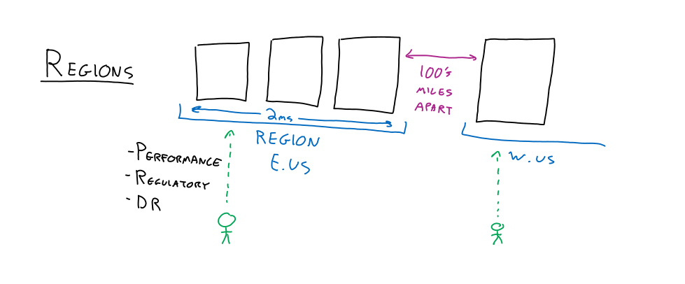
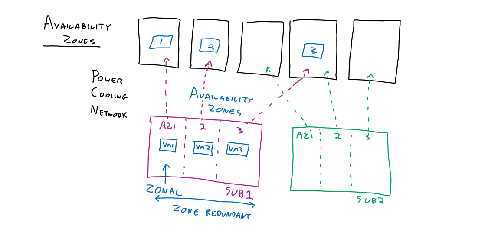
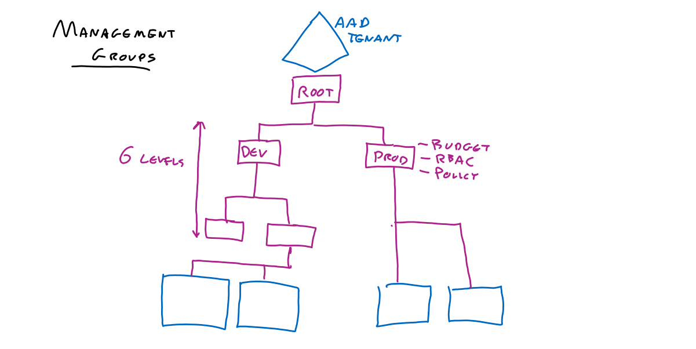
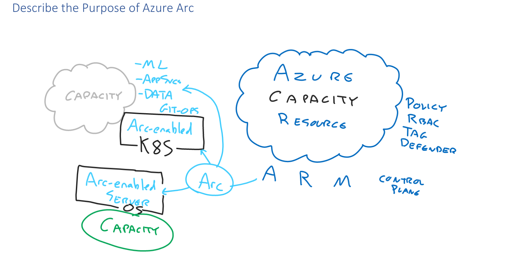

**Capital Expenditure (CapEx):** Here we have the concept of being able to completely understand the direction in which a 
company is moving and investing in something that we know will pay out over time. Unfortunately, usually it requires
big investments and large amounts of experience in the industry!

**Operational Expenditure (OpEx):** This is the concept of only paying for what you need, reducing initial investments. 
This is made possible by cloud services that are bordering the concept of infinite resources, which means that we can
easily up or down scale the amount of resources we use and pay for.

**Shared Responsibility Model:** Customer responsibility vs Provider responsibility

|                                             | On Premise |              IaaS              |   Paas   |
|---------------------------------------------|:----------:|:------------------------------:|:--------:|
| Date Application                        |  Customer  | Customer with tools from Azure | Customer |
| Runtime OS                              |  Customer  | Customer with tools from Azure |  Azure   |
| H/V -VM Compute Network Storage |  Customer  |             Azure              |  Azure   |

**Cloud Computing Types:** Public, Private, Hybrid

**Reliability:**
 - Auto Healing - redeploying a VM onto a new node upon node failure, etc.
 - Storage x3 - replicas on different racks or even availability zones
 - Auto Scaling - maintaining a level of performance to meet expected user performance
 - SLA (Service Level Agreement) - financially backed commitment from Azure
 - Design for Failure - multiple region design
 - Monitor - application insights

**Predictability:**
 - SKU
   - ACU (Azure Compute Unit) - defined performance units and storage unit that we get
 - Behaviour - known tools and services available
 - Use Templates - to have repeatable actions 
   - Automation
   - DevOps

Some regions are paired and some services will use that pairing automatically: [pairing table](https://learn.microsoft.com/en-us/azure/reliability/cross-region-replication-azure#azure-paired-regions)

**Availability Zones**
 - Within a 2ms round-trip networking distance
 - 3 zones available for each subscription
 - Zonal vs Zone Redundant: Zonal will be running on a specific zone (like a VM), where zone redundant will be deployed on all 3 zones

**Resource Groups**
 - You can have multiple resource groups in a subscription
 - You cannot have nested resource groups - flat structure
 - Used to group resources that share the same lifecycle
 - Used to group resources that share RBAC (Role-based Access Control)
 - Used to apply restricting policies
 - Used to apply budget limits
 - Apply tags (by default resource group tags are not inherited by resources)

**Subscriptions**
 - Subscriptions trust on and only on AD Tenant group

**Management Groups**
6 levels are counted excluding the root level and the subscription level (bottom blue blocks)

**Azure Resource Manager**
 - All  interactions go through this
 - This is a RESTFUL endpoint
 - The information of a resource is stored in a JSON format, which means we can automate creation processes

**Azure Arc**
 - tool to extend Azure services to planes outside of Azure: for example to utilize extra capacity from AWS
 - one scenario could be an agent on a machine, that makes Azure features available for that machine - extra capacity

**Virtual Machine Resources**
 - OS managed disk: stores the state of the operating system, so we don't lose it when a VM gets decommissioned
 - one or more data disks
 - VNET divided into subnets
 - we attach a vNIC to the VM which connects to the virtual networks
 - Optional: public IP bound to IP configurations
 - Optional: Network Security Group

# **Notes on what we pay for**
 - egress traffic going out of the region
 - we pay for AZ-AZ communication between availability zones